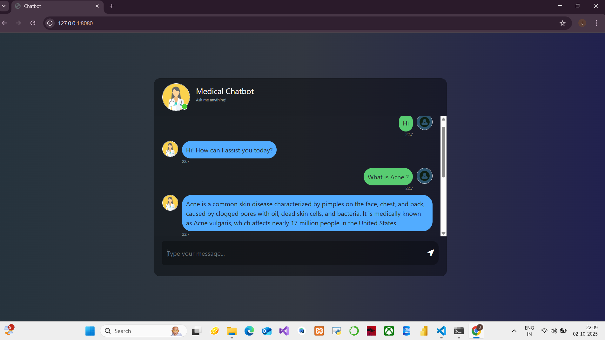

# AI Medical Chatbot

## 📌 Project Overview

The **AI Medical Chatbot** is a web-based application that provides answers to medical questions using a **retrieval-augmented generation (RAG)** approach.
It leverages **ChromaDB** for storing PDF document embeddings and **Mistral-7B** via Ollama for generating responses.

Users can ask questions about medical content, and the chatbot retrieves relevant information from uploaded PDF documents and provides concise answers. It also handles simple greetings and conversational messages.

---

## 💠 Features

* **Document ingestion**: Load PDF files and split them into text chunks for embedding.
* **Vector search**: Store embeddings in **ChromaDB** for fast semantic retrieval.
* **Large language model**: Use **Mistral-7B** via **Ollama** to generate human-like answers.
* **RAG chain**: Combines retrieved documents with LLM generation for context-aware answers.
* **Simple conversational fallback**: Responds to greetings like "hi" or "hello".
* **Web interface**: Interactive chat using **Flask** and **Bootstrap**.

---

## 📚 Project Structure

```
AI-Medical-Chatbot/
│
├─ data/                     # PDF files to be indexed
├─ chroma_db/                 # ChromaDB persisted embeddings
├─ research/
│  ├─ trails.ipynb
├─ src/
│  ├─ helper.py              # PDF loader, text splitter, embeddings
│  ├─ prompt.py              # System prompt template
├─ store_index.py             # Index PDFs into ChromaDB
├─ app.py                     # Flask web app
├─ templates/
│  └─ chat.html              # Chat interface
├─ static/
│  └─ style.css              # Chat UI styling
├─ requirements.txt           # Python dependencies
└─ README.md
```

---

## 🔨 Installation

1. **Clone the repository:**

```bash
git clone <your-repo-url>
cd AI-Medical-Chatbot
```

2. **Create Conda environment:**

```bash
conda create -n medibot python=3.10 -y
conda activate medibot
```

3. **Install dependencies:**

```bash
pip install -r requirements.txt
```

4. **Install Ollama** (for Mistral-7B):

* Download from [https://ollama.ai/download](https://ollama.ai/download)
* Install and verify with:

```bash
ollama --help
```

5. **Pull Mistral model:**

```bash
ollama pull mistral
```

---

## 📑 Usage

### 1. Index PDF files

Add your medical PDFs in the `data/` folder, then run:

```bash
python store_index.py
```

This creates embeddings and stores them in `chroma_db/`.

### 2. Start the chatbot

```bash
python app.py
```

Open your browser at [http://127.0.0.1:8080](http://127.0.0.1:8080).

### 3. Chat

* Type medical questions to get answers from your PDFs.
* Type greetings like "hi" to get friendly responses.

---

## 📸 App Preview  
  

---

## 🔧 Technologies Used

* **Python 3.10**
* **Flask** – Web framework
* **LangChain** – RAG and LLM integration
* **ChromaDB** – Vector database for document embeddings
* **Sentence-Transformers** – Embedding models (`all-MiniLM-L6-v2`)
* **Ollama** – Local LLM hosting for Mistral-7B
* **Bootstrap** – Frontend styling
* **dotenv** – Manage environment variables

---

## ⚠ Notes

* Ensure `store_index.py` is run before using the chatbot, otherwise it won’t have any indexed PDFs.
* Ollama stores models locally, so make sure you have enough disk space (~3–5 GB for Mistral-7B).
* This is a **development setup**. For production, consider using a proper WSGI server.

---

## 📌 License

This project is licensed under the MIT License.

